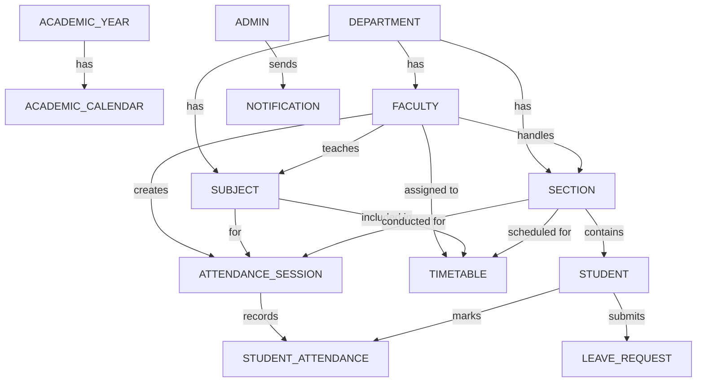
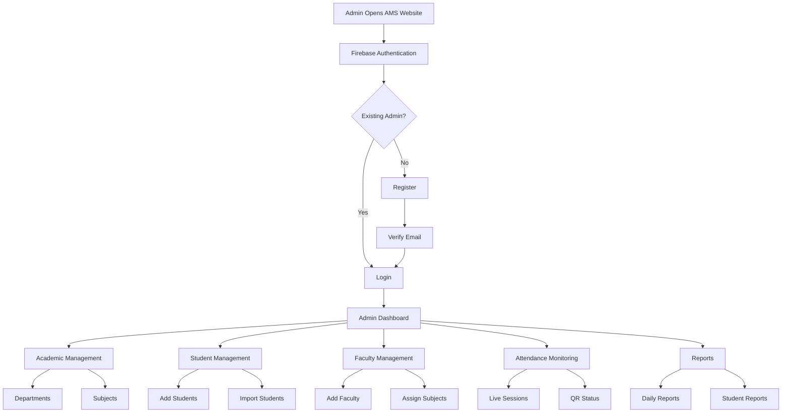

# Attendance Monitoring System (From Administrator's Perspective)

## Why do we need AMS from an Administrator's Perspective?

- Centralized Attendance Management
- Automatic Attendance Record Generation
- Reduction of Manual Errors and Proxy Attendance
- Efficient Timetable and Class Management
- Real-time Monitoring and Reporting
- Easy Communication with Students and Faculty
---
## What do we need to achieve AMS from an Administrator's Perspective?

### General Requirements

- Secure Administrator Login
- Access to student, faculty, and class information
- Monitor attendance across all departments and sections

**Technologies:**
- HTML, CSS, JavaScript (Frontend)
- Node.js, Express.js (Backend)
- MySQL (Database)
- JWT, bcrypt (Authentication)

---

### Student Management

- Add, update, delete, and view student details
- Assign students to departments, years, and sections
- Manage student credentials

**Code Location:**
- Frontend → Student Dashboard
- Backend → Student API
- Database → Student Table

---

### Faculty Management

- Add, update, delete, and view faculty details
- Assign faculty to subjects and classes

**Code Location:**
- Frontend → Faculty Dashboard
- Backend → Faculty API
- Database → Faculty Table

---

### Timetable Management

- Create, update, and delete timetables
- Assign subjects, faculty, classrooms, and timings
- Detect timetable conflicts automatically

**Technologies:**
- JavaScript (Conflict Checking)
- Node.js + Express.js
- MySQL

---

### Attendance Session Management

- Set QR expiry time
- Monitor active and expired sessions

---

### Attendance Monitoring

- View attendance records
- Monitor late comers and absentees
- Track attendance percentage

**Technologies:**
- MySQL
- Express.js
- Chart.js

---

### Attendance Request Management

- Receive attendance requests
- Approve or reject requests
- Maintain request history

**Code Location:**
- Frontend → Request Module
- Backend → Request API
- Database → Attendance_Request Table

---

### Notification Management

- Send notifications to students and faculty
- Send attendance shortage alerts
- Broadcast announcements

**Technologies:**
- NodeMailer
- Express.js
- Notification Table

---

### Report Generation

- Generate daily, weekly, and monthly reports
- Export reports as PDF or Excel
- Generate section-wise and department-wise reports

**Technologies:**
- jsPDF (PDF Reports)
- ExcelJS (Excel Reports)

---

### Attendance Zone Management

- Classify students into Green, Orange, and Red zones
- Automatically update attendance zones
- Identify low attendance students

**Technologies:**
- JavaScript
- MySQL

---

### Security and Access Control

- Secure administrator authentication
- Manage roles and permissions
- Maintain audit logs

**Technologies:**
- JWT
- bcrypt
- Role-Based Access Control (RBAC)
- Audit Logs


# SQL vs NoSQL — 5 Major Differences Based on App Features

| # | Feature | SQL | NoSQL |
|---|--------------|-------------|----------------|
| 1 | QR Attendance | Store token in a table; manual expiry logic is needed | TTL index automatically deletes QR after 30 seconds natively |
| 2 | Biometric + Location | Separate tables for fingerprint, face, and require complex joins | A single document stores biometric data, location, and timestamp together |
| 3 | Live Monitoring | Requires polling or additional tools for real-time updates | MongoDB Change Streams provide instant live updates |
| 4 | Automatic Timetable | Fixed schema makes changes difficult when timetable structure changes | Flexible documents allow adding periods, holidays, and subjects anytime |
| 5 | Calling Absentees + Permission | Multiple joins are needed to fetch student details, permissions, and call logs | A single document contains student details, permissions, and call status |

# Flow chart in all aspects


## Main Features of the System

- All academic and administrative data can be managed directly through the Admin Website without changing the source code.
- Administrators can add, update, or delete students, faculty, subjects, classrooms, departments, and notifications dynamically.
- The system automatically generates and updates timetables based on faculty, subjects, and classroom availability.
- Faculty members are automatically assigned to classes and subjects through the admin portal.
- Secure attendance is recorded using QR Code, Face Recognition, Fingerprint Verification, and Location Verification.
- Faculty can start attendance sessions, monitor attendance status, and approve or reject student permission requests.
- Students can view timetables, attendance records, notifications, and request permissions through the mobile application.
- The system automatically checks monthly permission limits and disables the permission option after the allowed limit is reached.
- Real-time notifications and pop-up alerts are provided for pending attendance, timetable changes, permissions, and important announcements.
- Attendance reports, analytics, and statistics are automatically generated for administrators and faculty.

28-6-2026

-The relationship between faulty and student and what is the work flow is the task i have done today below i am going to share step by step process of workflow




------------------------------------------------------------------------------------------------------------------

29-06-2026

------------------------------------------------------------------------------------------------------------------

| Collection | Document | Fields |
|------------|----------|--------|
| students | studentId | studentId, rollNumber, name, email, phone, gender, departmentId, sectionId, academicYearId, parentContact, attendancePercentage, status, createdAt(to know when the document was created it is optional purpose only) |
| faculty | facultyId | facultyId, name, email, phone, designation, departmentId, assignedSubjects, assignedSections, status, createdAt |
| departments | departmentId | departmentId, departmentName, description, createdAt |
| sections | sectionId | sectionId, sectionName, departmentId, academicYearId, classAdvisorId, studentCount, createdAt |
| subjects | subjectId | subjectId, subjectName, subjectCode, departmentId, semester, credits, facultyId, createdAt |
| academicYears | academicYearId | academicYearId, yearName, startDate, endDate, status |
| academicCalendar | eventId | eventId, academicYearId, eventName, eventType, startDate, endDate, description |
| timetables | timetableId | timetableId, sectionId, day, period, subjectId, facultyId, startTime, endTime, roomNumber |
| attendanceSessions | sessionId | sessionId, facultyId, subjectId, sectionId, sessionDate, period, qrCode, qrExpiryTime, status, presentCount, absentCount |
| studentAttendance | attendanceId | attendanceId, studentId, sessionId, status, markedTime, method, isLate |
| notifications | notificationId | notificationId, title, message, targetType, targetId, createdAt, isRead |
```

- In our system, notifications are planned to improve communication between students and faculty. Notifications can be sent to all students, all faculty members, or to individual students and teachers whenever required. For example, common announcements can be sent to everyone, while attendance alerts or important updates can be sent to specific students or faculty members. just iI thought it could be nice .

