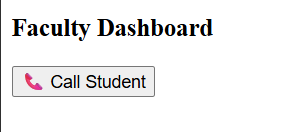

# Why we need Attendance Monitoring System from Faculty Perspective?

 **Key Points:**
- Maintain classroom discipline.
- To reduce time on attendance taking.
- Reduce faculty workload (attendance, phone calls, records,).

# What are the Functional Requirements?

**General Requirements**
-   Faculty should be able to login easily and securely
-   Faculty should have accessss to student details of that class
-   Faculty should be able to start attendance for each period separately

**Attendance Session Creation(QR generation)**
-   Faculty should be able to create an attendance session for every class period
-   System should automatically generate a QR code for that session using particulars(sessionID,class,sub,period,year,classID...)
-   QR code should work only for that limited time of 2 minuutes(start and end time )

**Live Attendance Monitoring**
-   Faculty should be able to see live attendance while students are scanning QR
-   Present, late, and absent count should update automatically
-   Faculty should be able to Take head count during qr scanning

**Late Commers Attendence Management**
-   Ability to access location information while logging in attendence (only for late commers)
-   Ability to check the late entries after the class (only for that respective start and end time of the period on that day)

**Absentee Tracking**
-   After session ends, system should automatically show absent students
-   It should remove students who are present and who have permission for leave
-   Only real absentees should be listed 
-   Faculty should be able to see student phone no and parent phone no if they need to contact them. 
-   There should be a direct call option, especially for students who are frequently absent or without permission

**Reports and Records**
-   Faculty should be able to view daily and monthly attendance
-   System should generate reports automatically
-   Attendance data should be exportable through (PDF/Excel)

# How do we achive AMS?
Identify Entities, Attributes and Realationships
## Entities and Attributes

### 1. Faculty
- Faculty_ID (PK)
- Faculty_Name
- Dept
- Email
- Phone

### 2.Student
- Student_ID (PK)
- Student_Name
- Roll_No
- Dept
- Section
- Year
- Phone
- Age

### 3. QR_Session
- Session_ID (PK)
- Class/Subject
- Date
- Start_Time
- End_Time
- Status

### 4. Attendance
- Attendance_ID (PK)
- Date
- Period
- Timestamp
- Status (Present / Late / Absent)

### 5. Late_Arrival
- Request_ID (PK)
- Arrival_Time
- Reason
- Status (Pending / Approved / Rejected)

### 6. Attendance_Report
- Report_ID (PK)
- Date
- Total_Students
- Present_Count
- Attendance_Percentage

### 7. Administrative
- Admin_ID (PK)
- Admin_Name
- Email
- Role

## Relationships
### Faculty → QR_Session
- One Faculty can create many QR Sessions
- Each QR Session is created by one Faculty
**Cardinality:** 1 : N

## Faculty → Late_Arrival
- One Faculty can verify many Late Arrival requests
- Each Late Request is handled by one Faculty
**Cardinality:** 1 : N

## QR_Session → Attendance
- One QR Session generates many Attendance records
- Each Attendance record belongs to one QR Session
**Cardinality:** 1 : N

## Student → Attendance
- One Student can have many Attendance records
- Each Attendance record belongs to one Student
**Cardinality:** 1 : N

## Student → Late_Arrival
- One Student can submit many Late Requests
- Each Late Request belongs to one Student
**Cardinality:** 1 : N

## Attendance → Attendance_Report
- Many Attendance records contribute to one Report
- Each Report is generated from multiple Attendance records
**Cardinality:** N : 1

## Administrative → Attendance_Report
- One Admin can monitor many Reports
- Each Report is monitored by Admin
**Cardinality:** 1 : N

# we need to discuss about the technical stack?
## Frontend (User Interface)
Web App (Preferred for faculty dashboard)
-   HTML5, CSS3, JavaScript
-   Framework: React.js (or simple Bootstrap-based UI)

## Backend (System Logic)
#### Handles attendance processing, QR validation, and data management.
* Node.js 
* Express.js
(Alternative: Python / Flask)

## Database (Data Storage)
Stores student, faculty, and attendance records.

* MySQL (recommended for structured data)
(Alternative: MongoDB for flexible schema)

## QR Code System (Core Feature)
**Library:** qrcode (Node.js / Python)
**Scanner:** Web camera-based scanning (JavaScripgit addt: html5-qrcode)

## Authentication & Securitys
* JWT (JSON Web Token) for login sessions
* Password encryption (bcrypt)

**Why it needed:**
- Prevent proxy attendance
- Ensure only valid faculty generates sessions

## Hosting / Deployment
**Frontend:** Vercel / Netlify
**Backend:** Render / AWS / Railway
**Database:** MySQL 

### Main tables:
STUDENT
FACULTY
ATTENDANCE
QR_SESSION
ADMIN

## Sample call button

