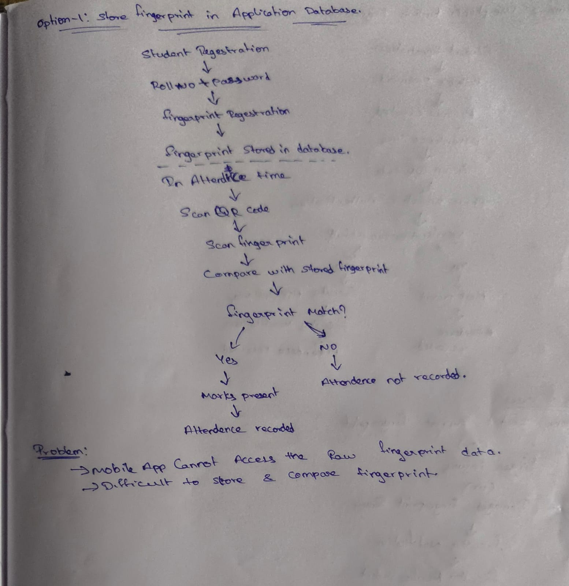

# Login with Biometric Verification

## How it Works

1. The student logs in using Roll Number and Password.
2. During attendance, the student scans the QR code displayed by the faculty.
3. The app asks for fingerprint verification.
4. If the fingerprint is verified, attendance is marked as Present.

---

## Problems with Fingerprint Verification

### Phone Does Not Support Fingerprint

Some students may have phones without a fingerprint sensor. In this case, fingerprint verification cannot be used.

### Finger Injury

If a student has a finger injury, the fingerprint may not be recognized properly.

### Damaged Fingerprint Sensor

If the phone's fingerprint sensor is damaged, verification may fail even if the student is present.

### Proxy Attendance

A phone can store multiple fingerprints. If another student's fingerprint is registered on the same device, there is still a chance of proxy attendance.

---

## Preferred Method

The system uses the phone's built-in fingerprint authentication instead of storing fingerprints in the database.

This is:

* Easier to implement
* More secure
* Better for privacy

---

## Fallback Method

If fingerprint verification fails:

1. The student scans the QR code.
2. A verification request is sent to the faculty.
3. The faculty checks whether the student is present in class.
4. The faculty can manually approve the attendance.

This helps students in special situations such as finger injuries, unsupported devices, or sensor problems.
# Login with Biometric Verification

## Option 1 - Store Fingerprint in Database

In this approach, the student's fingerprint is registered during account setup and stored in the database. During attendance, the scanned fingerprint is compared with the stored fingerprint before marking attendance.

### Problems

- Mobile apps cannot directly access raw fingerprint data.
- Some phones do not support fingerprint sensors.
- Finger injuries may cause verification failure.
- Damaged fingerprint sensors may prevent authentication.
- Storing biometric data creates privacy and security concerns.

---

## Option 2 - Use Phone's Built-in Fingerprint (Recommended)

In this approach, the system uses the phone's built-in biometric authentication instead of storing fingerprints in the database.

### Advantages

- Easier to implement.
- Better privacy and security.
- No fingerprint data stored in the database.
- Uses the phone's existing biometric system.

---

## Final Solution

The final solution uses QR code scanning and phone biometric verification. If verification fails because of unsupported devices, finger injuries, or sensor issues, faculty approval can be used as a fallback method.

