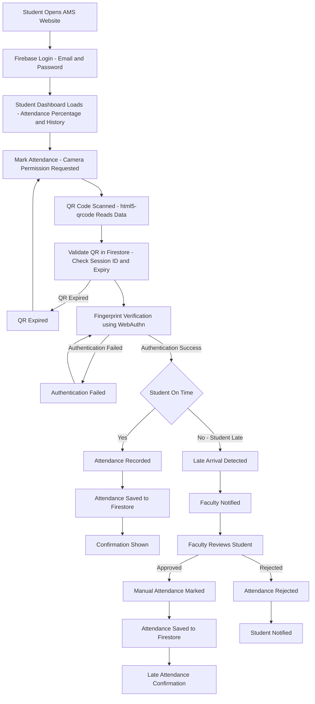

# Attendence Monitoring System (From Students Perspective)

## Why do we need AMS from a Students Presective?
- Authenticated Student Attendence (QR Code captured with Biometirc authorized )
- Late Commers Attendence Management (location aware requested to mark attendence)
- Regular Attendence tracking

## What do we need to achive AMS from as Students Perspective?
- General requriements
-   Access to student deatails of that class
-   Access to the faculty and subject of the respective class on that day and time
-   Acesss to each student deatils per login session (registration and login)

- Authenticated Student Attendence
-   Ability to Capture QR Code (in a students mobile phone)
-   Ability to Capture Biometric(in a student  mobile phone)

- Late Commers Attendence Management  
-   Ability to access location information while logging in attendence (only for late commers)
-   Ability to submit attendence request irrespective of the class (only for that respective start and end time of the period on that day)

- Regular Attendence Tracking

## How do we achive AMS?
Identify Entities, Attributes and Realationships
## Entities and Attributes

### 1. Student

* Student_ID (PK)
* Roll_Number
* Name
* Email
* Section
* Password

### 2. Attendance

* Attendance_ID (PK)
* Date
* Time
* Status (Present / Late Present / Absent)

### 3. QR_Session

* Session_ID (PK)
* QR_Code
* Session_Date
* Session_Time
* Expiry_Time

### 4. Timetable

* Timetable_ID (PK)
* Subject_Name
* Faculty_Name
* Day
* Start_Time
* End_Time
* Section

### 5. Notification

* Notification_ID (PK)
* Message
* Date
* Type

### 6. Attendance_Request

* Request_ID (PK)
* Request_Date
* Reason
* Status (Pending / Approved / Rejected)

### 7. Attendance_Zone

* Zone_ID (PK)
* Zone_Name (Green / Orange / Red)
* Attendance_Percentage_Range

## Relationships
### student -> Attendence
* One Student can have many Attendance records.
* One Attendance record belongs to one Student.
**Cardinality:** 1 : M

### Student — Scans → QR_Session

* One Student can scan many QR sessions.
* One QR session can be scanned by many Students.

**Cardinality:** M : N

### Student — Views → Timetable

* Many Students can view the same Timetable.
* One Timetable belongs to a specific Section.

**Cardinality:** M : 1

### Student — Receives → Notification

* One Student can receive many Notifications.

**Cardinality:** 1 : M

### Student — Submits → Attendance_Request

* One Student can submit many Attendance Requests.

**Cardinality:** 1 : M

### Student — Belongs To → Attendance_Zone

* One Student belongs to one Attendance Zone.
* One Attendance Zone can contain many Students.

**Cardinality:** M : 1
 

we need to discuss about the technical stack?
# Technology Stack & Libraries

## Frontend

* HTML5
* CSS3
* JavaScript (ES6)

### Libraries

* html5-qrcode (QR Code Scanner)
* Web Authentication API (Phone Fingerprint Authentication)

## Backend

* Node.js
* Express.js

### Libraries

* Express
* CORS
* dotenv
* jsonwebtoken (JWT)
* bcrypt

## Database

* MySQL

### Libraries

* mysql2

## Authentication

* Roll Number & Password Login
* Device Fingerprint Authentication (Biometric Authentication)

## QR Code Management

### QR Code Generation

* qrcode

### QR Code Scanning

* html5-qrcode

## Development Tools

* Visual Studio Code
* Git
* GitHub
* Postman

## Deployment

* Netlify (Frontend)
* Render / Railway (Backend)
* GitHub (Version Control)

